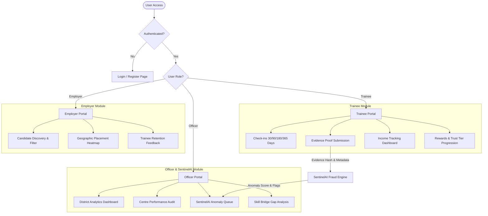

# 🛡️ Lifelong Livelihood Support Platform

> **Smart India Hackathon (SIH) — Problem Statement 26135**  
> State Livelihood Outcome Tracking, AI-Verified Beneficiary Incentives & SentinelAI Fraud Detection Platform.

[](https://nextjs.org/)
[](https://react.dev/)
[](https://www.typescriptlang.org/)
[](https://tailwindcss.com/)
[](https://sih.gov.in/)

---

## 📋 Table of Contents

- [Overview](#-overview)
- [Key Modules & Features](#-key-modules--features)
  - [🎓 Trainee Portal](#-trainee-portal)
  - [🏢 Employer Portal](#-employer-portal)
  - [👮 Officer Portal](#-officer-portal)
  - [🤖 SentinelAI Engine](#-sentinelai-engine)
- [Tech Stack](#-tech-stack)
- [Project Architecture](#-project-architecture)
- [Directory Structure](#-directory-structure)
- [Getting Started](#-getting-started)
- [Available Scripts](#-available-scripts)
- [Role-Based Workflows](#-role-based-workflows)
- [Contributing](#-contributing)
- [License](#-license)

---

## 🌐 Overview

The **Lifelong Livelihood Support Platform** is an end-to-end outcome-based tracking and incentive ecosystem designed for government skill development programs (PMKVY, DDU-GKY, State Skill Missions). Addresses **SIH PS 26135** by bridging the critical gap between post-training employment placement and long-term livelihood sustenance.

### Core Objectives
1. **Long-Term Outcome Verification**: Continuous post-placement verification at 30, 90, 180, and 365 days.
2. **SentinelAI Anomaly Detection**: Automated detection of ghost trainees, fraudulent salary slips, duplicate proof submissions, and center collusion.
3. **Verified Beneficiary Incentives**: Direct Benefit Transfer (DBT) milestone rewards unlocked as trainees build trust-tier progression.
4. **Data-Driven Policy & Skill Bridge**: Sector-wise gap analysis and training center performance auditing for government decision-makers.

---

## 🚀 Key Modules & Features

### 🎓 Trainee Portal (`/trainee`)
- **Dashboard & Income Tracking**: Real-time visualization of monthly earnings progression and verified employment status.
- **Milestone Check-ins (`/trainee/checkins`)**: Interactive outcome reporting at Day 30, 90, 180, and 365 post-training.
- **Multi-Modal Evidence Upload (`/trainee/evidence`)**: Submission of salary slips, employer certificates, self-declarations, and bank statements.
- **Rewards & Trust Tier System (`/trainee/rewards`)**: Progress from **Tier 1 (Unverified)** to **Tier 3 (Gold Verified)** with associated incentive payouts and trust badges.

### 🏢 Employer Portal (`/employer`)
- **Talent Discovery (`/employer/candidates`)**: Search and filter candidate pool by district, sector, skill set, and trust tier rating.
- **Geographic Placement Heatmap (`/employer/heatmap`)**: Interactive visualization of regional talent concentration and job market demand.
- **Trainee Feedback & Verification (`/employer/feedback`)**: Direct employer feedback and workplace retention verification mechanism.

### 👮 Officer Portal (`/officer`)
- **District Analytics (`/officer/analytics`)**: Macro-level placement rates, average wage growth, and retention metrics across districts.
- **Training Centre Performance (`/officer/center-performance`)**: Scorecards, audit metrics, placement quality, and compliance tracking.
- **SentinelAI Review Queue (`/officer/sentinel`)**: High-priority anomaly queue with interactive modal actions for flag resolution, evidence overrides, or site inspection orders.
- **Skill Bridge Gap Analysis (`/officer/skill-bridge`)**: Dynamic comparison between employer demand and training curriculum outputs.

### 🤖 SentinelAI Engine
- **Automated Anomaly Scoring**: Cross-verifies salary records, employer tax registration, geolocation, and document signatures.
- **Fraud Pattern Detection**: Flags duplicate document hashes, unnatural salary spikes, and training center batch anomalies.
- **Human-in-the-Loop Override**: Provides government officers with full transparency, audit trails, and flag mitigation controls.

---

## 🛠️ Tech Stack

| Layer | Technology | Details |
| :--- | :--- | :--- |
| **Framework** | Next.js 14 | App Router architecture with server & client components |
| **Language** | TypeScript 5.6 | Strict type-safety across models, API responses, and UI props |
| **UI & Styling** | React 18 & Tailwind CSS 3 | Modern dark/light glassmorphic UI design system |
| **Data Viz** | Recharts 2.13 | Interactive analytics charts, wage trends, and district stats |
| **Iconography** | Lucide React | Clean, responsive UI icons |
| **State & Auth** | React Context API | `AuthProvider` for session management & `RoleProvider` for permissions |

---

## 🏗️ Project Architecture



---

## 📂 Directory Structure

```
sih ps/
├── frontend/
│   ├── app/                         # Next.js 14 App Router Pages
│   │   ├── layout.tsx               # Root layout (AuthProvider + RoleProvider)
│   │   ├── page.tsx                 # Landing page & role-based redirect
│   │   ├── login/                   # User authentication & role switch
│   │   ├── register/                # Trainee / Employer onboarding
│   │   ├── trainee/                 # Trainee portal routes
│   │   │   ├── checkins/            #   └── Milestone check-in workflow
│   │   │   ├── evidence/            #   └── Proof document upload & status
│   │   │   ├── income/              #   └── Monthly income progression
│   │   │   └── rewards/             #   └── DBT rewards & trust tier status
│   │   ├── employer/                # Employer portal routes
│   │   │   ├── candidates/          #   └── Candidate pool & skill filter
│   │   │   ├── feedback/            #   └── Performance feedback submission
│   │   │   └── heatmap/             #   └── Talent regional distribution
│   │   └── officer/                 # Officer portal routes
│   │       ├── analytics/           #   └── District level placement analytics
│   │       ├── center-performance/  #   └── Training center audit scorecards
│   │       ├── sentinel/            #   └── SentinelAI verification queue
│   │       └── skill-bridge/        #   └── Industry skill gap matrix
│   ├── components/                  # UI Components by feature area
│   │   ├── auth/                    #   Login/register forms & role badges
│   │   ├── checkins/                #   Check-in cards & form modal
│   │   ├── employer/                #   Candidate cards & heatmap widgets
│   │   ├── evidence/                #   Evidence dropzones & status pills
│   │   ├── layout/                  #   Navigation bar, sidebar & main shell
│   │   ├── officer/                 #   Metric cards & district filters
│   │   ├── provider/                #   Context wrapper components
│   │   ├── rewards/                 #   Tier badges & payout history
│   │   ├── sentinel/                #   Anomaly resolution modals & logs
│   │   └── trainee/                 #   Trainee dashboard metrics
│   ├── lib/                         # Application logic & mock data
│   │   ├── api/                     # Mock API client services
│   │   ├── context/                 # AuthContext & RoleContext definitions
│   │   ├── types/                   # TypeScript interfaces & types
│   │   └── mock-data.ts             # Comprehensive dataset for simulation
│   ├── public/                      # Static branding assets & icons
│   ├── tailwind.config.js           # Tailwind CSS theme customization
│   ├── tsconfig.json                # TypeScript compiler config
│   └── package.json                 # Frontend dependencies & run scripts
└── README.md                        # Master repository documentation
```

---

## ⚡ Getting Started

### Prerequisites
- **Node.js**: `v18.x` or higher
- **npm**: `v9.x` or higher

### Installation & Run

1. **Clone the Repository**:
   ```bash
   git clone https://github.com/praveshkumar067/frontend-sihps.git
   cd frontend-sihps
   ```

2. **Navigate to Frontend Directory**:
   ```bash
   cd frontend
   ```

3. **Install Dependencies**:
   ```bash
   npm install
   ```

4. **Start Development Server**:
   ```bash
   npm run dev
   ```
   > *Note for Windows PowerShell*: If script execution is restricted, run via CMD or use: `cmd /c "npm run dev"`.

5. **Access Application**:
   Open browser at [http://localhost:3000](http://localhost:3000).

---

## 📜 Available Scripts

Run these commands inside the `frontend/` directory:

| Script | Command | Purpose |
| :--- | :--- | :--- |
| **Dev Server** | `npm run dev` | Launches Next.js dev server with hot reload on port `3000` |
| **Build** | `npm run build` | Compiles optimized production bundle |
| **Start** | `npm run start` | Launches production server after build |
| **Lint** | `npm run lint` | Performs code quality and style checks via ESLint |

---

## 🔑 Role-Based Workflows

| User Role | Default Route | Primary Responsibilities & Access |
| :--- | :--- | :--- |
| 🎓 **Trainee** | `/trainee` | Submit milestone check-ins, upload salary/employment evidence, track income growth, unlock trust tier badges, receive DBT rewards. |
| 🏢 **Employer** | `/employer` | Search verified talent pool, filter candidates by skill/district, inspect candidate trust scores, view regional talent heatmaps, provide trainee feedback. |
| 👮 **Government Officer** | `/officer` | Review district-wide placement analytics, audit training centers, resolve SentinelAI fraud alerts, analyze skill gaps between industry demand and training supply. |

---

## 🤝 Contributing

1. **Fork** the repository
2. **Create Feature Branch**: `git checkout -b feature/your-feature-name`
3. **Commit Changes**: `git commit -m 'feat: add new feature'`
4. **Push to Branch**: `git push origin feature/your-feature-name`
5. **Open Pull Request**

---

<p align="center">
  Developed with ❤️ for <strong>Smart India Hackathon</strong> — PS 26135
</p>

