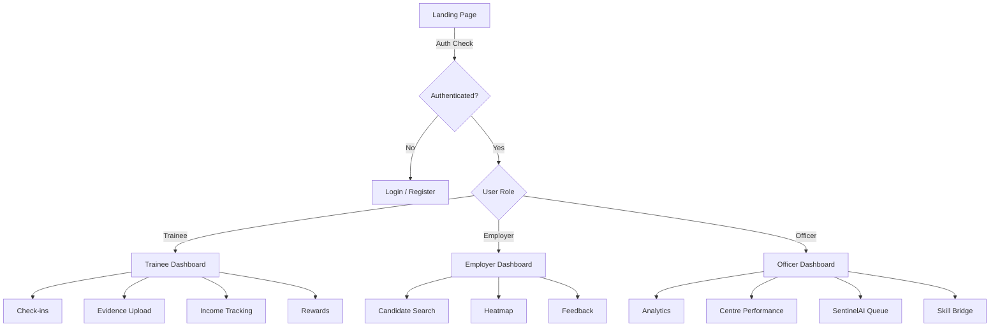

# 🛡️ Lifelong Livelihood Support Platform

> **SIH Problem Statement 26135** — State outcome tracking, verified beneficiary incentives, and SentinelAI verification platform.

---

## 📋 Table of Contents

- [Overview](#overview)
- [Key Features](#key-features)
- [Tech Stack](#tech-stack)
- [Project Structure](#project-structure)
- [Getting Started](#getting-started)
- [Available Scripts](#available-scripts)
- [Role-Based Access](#role-based-access)
- [Architecture](#architecture)
- [Contributing](#contributing)
- [License](#license)

---

## Overview

The **Lifelong Livelihood Support Platform** is a comprehensive web application designed to track skill-development outcomes, verify beneficiary progress, and incentivize livelihood sustenance across India. Built for the **Smart India Hackathon (SIH)**, it addresses PS 26135 by providing role-based dashboards for trainees, employers, and government officers.

The platform incorporates **SentinelAI** — an AI-driven verification engine — to detect anomalies, validate evidence submissions, and assign trust tiers to beneficiaries.

---

## Key Features

### 🎓 Trainee Portal
- Personalised dashboard with training progress & income tracking
- Evidence upload for employment/income verification
- Periodic check-in system
- Rewards & incentive tracking with trust-tier progression

### 🏢 Employer Portal
- Candidate discovery via heatmap and search
- Feedback submission for placed trainees
- Placement verification workflow

### 👮 Officer Portal
- District-level analytics & centre performance monitoring
- SentinelAI verification queue with action modals
- Skill-bridge gap analysis

### 🤖 SentinelAI
- AI-powered anomaly detection for submitted evidence
- Trust-tier based verification pipeline
- Officer action modals for manual review/override

---

## Tech Stack

| Layer        | Technology                                                     |
| ------------ | -------------------------------------------------------------- |
| Framework    | [Next.js 14](https://nextjs.org/) (App Router)                |
| Language     | [TypeScript](https://www.typescriptlang.org/)                  |
| UI Library   | [React 18](https://react.dev/)                                 |
| Styling      | [Tailwind CSS 3](https://tailwindcss.com/)                     |
| Charts       | [Recharts](https://recharts.org/)                              |
| Icons        | [Lucide React](https://lucide.dev/)                            |
| Fonts        | [Inter](https://fonts.google.com/specimen/Inter) (Google Fonts)|
| Utilities    | clsx, tailwind-merge                                           |

---

## Project Structure

```
sih ps/
├── frontend/
│   ├── app/                    # Next.js App Router pages
│   │   ├── layout.tsx          # Root layout (AuthProvider + RoleProvider)
│   │   ├── page.tsx            # Landing — redirects by role
│   │   ├── login/              # Login page
│   │   ├── register/           # Registration page
│   │   ├── trainee/            # Trainee dashboard & sub-pages
│   │   │   ├── checkins/       #   └── Check-in system
│   │   │   ├── evidence/       #   └── Evidence upload
│   │   │   ├── income/         #   └── Income tracking
│   │   │   └── rewards/        #   └── Rewards & incentives
│   │   ├── employer/           # Employer dashboard & sub-pages
│   │   │   ├── candidates/     #   └── Candidate search
│   │   │   ├── feedback/       #   └── Trainee feedback
│   │   │   └── heatmap/        #   └── Geographic heatmap
│   │   └── officer/            # Officer dashboard & sub-pages
│   │       ├── analytics/      #   └── District analytics
│   │       ├── center-performance/ # └── Training centre metrics
│   │       ├── sentinel/       #   └── SentinelAI review queue
│   │       └── skill-bridge/   #   └── Skill gap analysis
│   ├── components/             # Reusable UI components
│   │   ├── auth/               #   Authentication components
│   │   ├── checkins/           #   Check-in components
│   │   ├── employer/           #   Employer-specific components
│   │   ├── evidence/           #   Evidence upload/display
│   │   ├── layout/             #   Headers, sidebars, shells
│   │   ├── officer/            #   Officer-specific components
│   │   ├── provider/           #   Context providers
│   │   ├── rewards/            #   Rewards components
│   │   ├── sentinel/           #   SentinelAI action modals
│   │   └── trainee/            #   Trainee-specific components
│   ├── lib/
│   │   ├── api/                # API service layer
│   │   ├── context/            # React Context (Auth, Role)
│   │   ├── types/              # TypeScript type definitions
│   │   └── mock-data.ts        # Mock data for development
│   ├── public/                 # Static assets
│   ├── tailwind.config.js      # Tailwind configuration
│   ├── tsconfig.json           # TypeScript configuration
│   └── package.json            # Dependencies & scripts
└── README.md
```

---

## Getting Started

### Prerequisites

- **Node.js** ≥ 18.x
- **npm** ≥ 9.x (or yarn / pnpm)

### Installation

```bash
# 1. Clone the repository
git clone https://github.com/praveshkumar067/frontend-sihps.git
cd frontend-sihps

# 2. Navigate to the frontend directory
cd frontend

# 3. Install dependencies
npm install

# 4. Start the development server
npm run dev
```

The app will be available at **http://localhost:3000**.

---

## Available Scripts

| Command          | Description                          |
| ---------------- | ------------------------------------ |
| `npm run dev`    | Start the development server         |
| `npm run build`  | Create an optimised production build  |
| `npm run start`  | Run the production server             |
| `npm run lint`   | Run ESLint for code quality checks    |

---

## Role-Based Access

The platform supports three distinct user roles, each with a dedicated dashboard:

| Role       | Route        | Description                                      |
| ---------- | ------------ | ------------------------------------------------ |
| **Trainee**  | `/trainee`   | Skill-development beneficiary dashboard          |
| **Employer** | `/employer`  | Hiring partner dashboard with candidate tools    |
| **Officer**  | `/officer`   | Government officer dashboard with analytics      |

Authentication is handled via `AuthContext` with session persistence in `localStorage`. On login, users are automatically redirected to their role-specific dashboard.

---

## Architecture



### Context Providers

- **`AuthProvider`** — Manages user sessions, login/register flows, consent, and trust-tier updates.
- **`RoleProvider`** — Supplies role-specific configuration and permissions across the component tree.

---

## Contributing

1. **Fork** the repository
2. **Create** a feature branch (`git checkout -b feature/amazing-feature`)
3. **Commit** your changes (`git commit -m 'Add amazing feature'`)
4. **Push** to the branch (`git push origin feature/amazing-feature`)
5. **Open** a Pull Request

---

## License

This project is developed as part of the **Smart India Hackathon (SIH)** initiative.

---

<p align="center">
  Built with ❤️ for <strong>Smart India Hackathon</strong> — PS 26135
</p>
